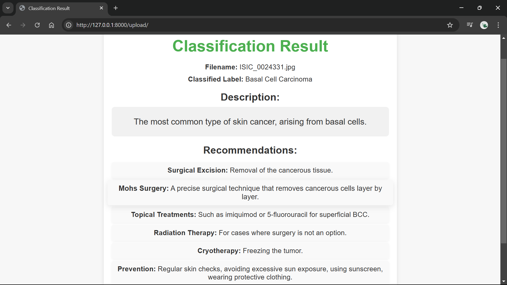
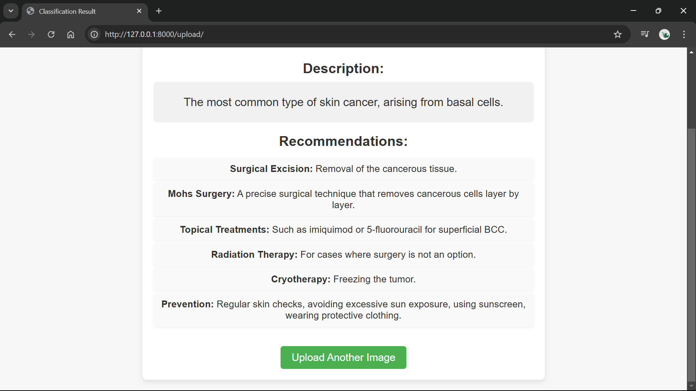

# Skin Disease Detection Application

## Description
This application is a skin disease detection tool built using FastAPI. It utilizes a YOLO model to classify images of skin conditions and provides relevant information about the detected diseases.

## Installation
To install the required dependencies, run the following command:

```bash
pip install -r requirements.txt
```

## Usage
1. change the directory `cd app`.
2. Start the FastAPI server by running command `uvicorn main:app --reaload` in the terminal.
3. Navigate to `http://localhost:8000` in your web browser.
4. Upload an image of the skin condition you want to classify.
5. The application will return the classification result along with detailed information about the disease.
6. This application uses YOLOv11 architecture, and the dataset is clubbed from various datasets and normalized for the project purpose. 
7. When `main.py` is run, it initially takes some time, after that the website will be highly responsive.

## Disease Information
The application can classify the following skin conditions:

- Nevi
- Melanoma
- Normal
- Basal Cell Carcinoma
- Actinic Keratoses
- Benign Keratosis Like Lesions
- Basal Cell Carcinoma
- Vascular Lesions
- Dermatofibroma

## Output Web Pages

- Home Page
    
- Result Page
    
- Reupload Option
    